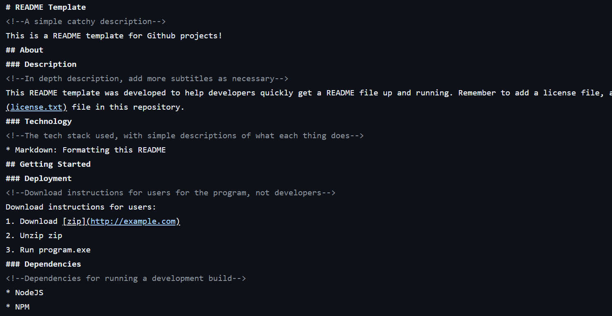

<!--Project title here-->
# README Template
<!--A simple catchy description-->
This is a README template for Github projects!
## About
<!--An image to show your project-->

### Description
<!--In depth description, add more subtitles as necessary-->
This README template was developed to help developers quickly get a README file up and running. Remember to add a license file, and change the year and name, if you are using the [license.txt](license.txt) file in this repository.
### Technology
<!--The tech stack used, with simple descriptions of what each thing does-->
* Markdown: Formatting this README
## Getting Started
### Deployment
<!--Download instructions for users for the program, not developers-->
Download instructions for users:
1. Download [zip](http://example.com)
2. Unzip zip
3. Run program.exe
### Dependencies
<!--Dependencies for running a development build-->
* NodeJS
* NPM
### Installation
<!--Installation and setup instructions for developers-->
Installation and setup instructions for developers:
1. Install latest (LTS) version of NodeJS
2. Verify your installation by running `node -v; npm -v command` in your terminal, you should see two version outputs
3. Fork and clone the repository
4. Install project dependencies by running `npm i` from project root
5. Start coding and build something awesome!
### Contributing
<!--Talk about state of project. Instructions to forking and developing.-->
This project is no longer under active development. Suggestions, issues and bug reports will not be actively resolved. However, pull requests and forks are always welcome!
## Help
### Controls
<!--Controls for users to navigate the program-->
	Esc - Closes the program
	Space - Jumps
### Commands
<!--Commands for developers to start the project-->
	npm run dev - Starts the project
	npm run test - Runs test cases
## Authors
<!--List of authors with links to their GitHub-->
Austin Kong [@AustinKong](https://github.com/AustinKong)
## License
<!--Simple description of license, linked to license.txt file-->
This project is licensed under MIT license. View license in [license.txt](license.txt)

